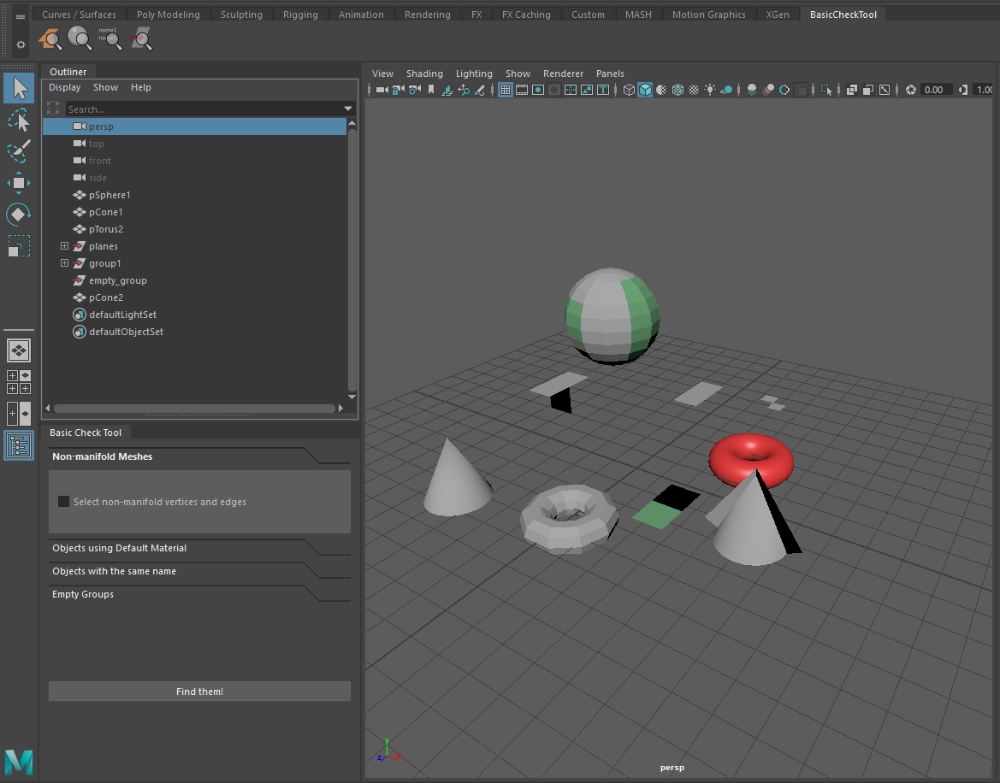

# Maya Basic Check Tool

A Maya plugin that provides basic scene cleanup functions.
The tools provided are:
-  Finding objects with non-manifold polygon geometry
- Finding objects that use the default Maya material
- Finding objects that share names / whose names are not unique
- Find and remove empty groups in the outliner

## Installation

1. Download this git repository to a directory of your choice.
2. Create a **Maya.env** file in: 
_MAYA_APP_DIR/maya/MAYA_VER/_

(this is usually under _USER/Documents/maya/2020/_)

3. Add the following line:
 <blockquote>MAYA_MODULE_PATH = [path to the directory you downloaded this repository to]</blockquote>
 If you already have a **Maya.env** file, simply add the [path to module directory] to the MAYA_MODULE_PATH variable in it. For example: <blockquote>MAYA_MODULE_PATH = [Previous Contents];[path to module directory]</blockquote>

## Usage

The module comes with a custom shelf which is automatically installed on loading the plugin.
From this, all four tools are accessible via their buttons.
* Clicking a button once will perform the action immediately with pre-defined settings (this is for using it quickly)
* Double-Clicking the button will bring up a dockable tool window where some options can be configured
